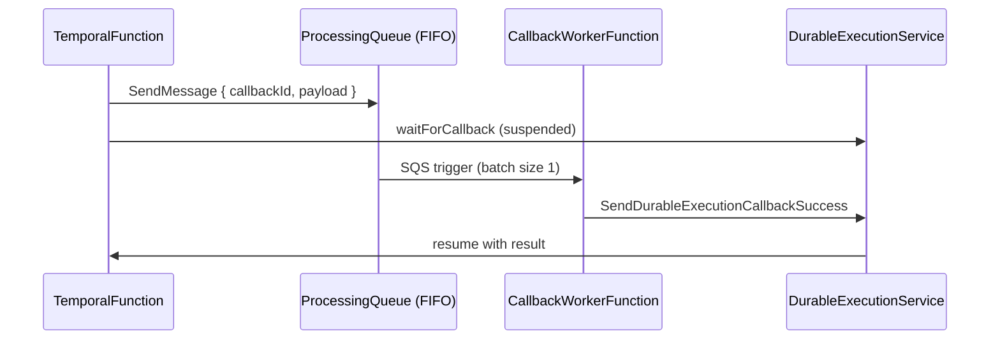

# durable-poc

Proof-of-concept for **AWS Lambda durable functions**: an orchestrator suspends on `waitForCallback`, enqueues work to a FIFO SQS queue, and resumes when a callback worker calls `SendDurableExecutionCallbackSuccess`.

**Stack:** `durable-stack` · **Region:** `eu-west-2` (see [`samconfig.toml`](samconfig.toml))

## How it works



Both Lambdas share **`TemporalExecutionRole`**. The orchestrator publishes to the queue; the worker polls it and completes the durable callback.

## Prerequisites

- Node.js 24+ (matches Lambda runtime in [`template.yaml`](template.yaml))
- [AWS SAM CLI](https://docs.aws.amazon.com/serverless-application-model/latest/developerguide/install-sam-cli.html)
- AWS credentials with permission to deploy CloudFormation, Lambda, SQS, and IAM

## Quick start

```bash
npm install
sam build && sam deploy
```

Invoke the orchestrator (must use the **`live` alias** — durable execution does not work on the unqualified function name):

```bash
./scripts/async.sh
```

Check CloudWatch Logs and X-Ray for `durable-stack-temporal` and `durable-stack-callback-worker`. A successful run returns `{ ok: true, logged, random, result }` from the orchestrator after the worker resumes the execution.

Lint workspaces before pushing:

```bash
npm run lint -w @durable-poc/temporal
npm run lint -w @durable-poc/callback-worker
```

## Project layout

| Path | Purpose |
|------|---------|
| [`src/temporal/`](src/temporal/) | Durable orchestrator — steps, `waitForCallback`, SQS submit |
| [`src/callback-worker/`](src/callback-worker/) | SQS consumer — Powertools FIFO batch, callback success |
| [`src/shared/trace.ts`](src/shared/trace.ts) | X-Ray `traceAsync` helper |
| [`template.yaml`](template.yaml) | SAM — both functions, FIFO queue, shared IAM role |
| [`Makefile`](Makefile) | SAM build targets for each function |
| [`scripts/async.sh`](scripts/async.sh) | Async invoke `durable-stack-temporal:live` |

npm workspaces: `@durable-poc/temporal`, `@durable-poc/callback-worker`, `@temporal/shared`.

## Things that trip people up

**Invoke the `:live` alias.** `AutoPublishAlias: live` is required for durable invokes. [`scripts/async.sh`](scripts/async.sh) targets `durable-stack-temporal:live`.

**Custom IAM role + SQS trigger.** When a Lambda uses a custom execution role (not SAM’s generated role), SAM does **not** auto-grant SQS poller permissions. This stack adds `sqs-processing-queue` on `TemporalExecutionRole` (`ReceiveMessage`, `DeleteMessage`, etc.). If deploy succeeds but the worker never consumes messages, check that policy.

**FIFO visibility vs timeout.** Queue `VisibilityTimeout` (60s) must be ≥ worker timeout (60s). Worker SQS event uses `BatchSize: 1` and `ReportBatchItemFailures`.

**Single `MessageGroupId` serializes everything.** The orchestrator currently sends all messages with `MessageGroupId: "DurableProcessingGroup"`, so FIFO processes one in-flight message for the whole stack. and this behavior is what we need to prove in this poc).

## Build details

SAM uses Makefile builders (`build-TemporalFunction`, `build-CallbackWorkerFunction`): each workspace runs `npm install && npm run build`, then copies `index.js` into the artifact.

Redeploy from scratch (optional):

```bash
STACK_NAME=durable-stack ./scripts/redeploy.sh
```

## Stack outputs

After deploy: `TemporalFunctionArn`, `CallbackWorkerFunctionArn`, `ProcessingQueueUrl`, `TemporalExecutionRoleArn` (see [`template.yaml`](template.yaml) Outputs).
